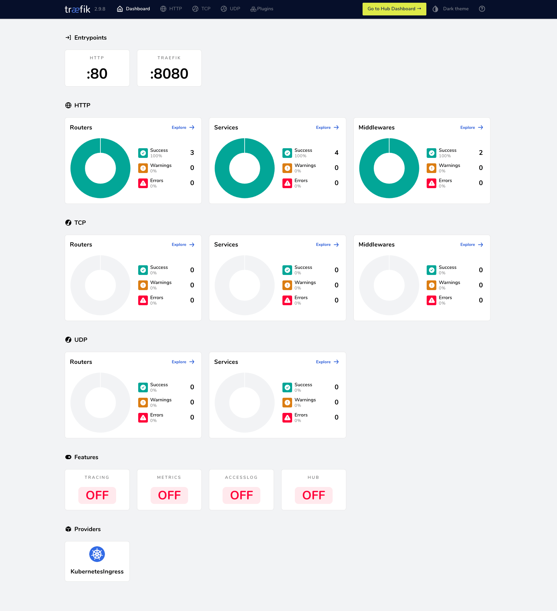

# Launch Traefik Proxy in a Kubernetes cluster with Proxy Wizard

To run Traefik Proxy in a Kubernetes cluster you need to create a handful of
[resources files](https://doc.traefik.io/traefik/getting-started/quick-start-with-kubernetes/)
to grant Traefik access to your cluster and to configure it to act as a reverse proxy
for your application.

Instead of doing all of that manually, with Proxy Wizard you can do it by running one single script.

**Note:** if you are running Kubernetes on Minikube, note the specific directions below. If not,
**ignore** these steps.

## Install Traefik Proxy

1. Open the terminal in your cluster's directory where you wish
to add Traefik's resource files.
1. Start Docker.
1. Start Minikube.
1. Run the Wizard script:

   ```shell
   curl -s https://raw.githubusercontent.com/VirtuaCreative/traefik-wizard/main/traefik-proxy-install.sh > ./traefik-proxy-install.sh
   sh traefik-proxy-install.sh
   ```

The Wizard script:

- Copies the example [resource files](../proxy-kube-resources/) from this project to a directory called
`traefik` on your computer.
- Deploys the Traefik Proxy Dashboard on port 8080.
- Deploys and an example application [`hello-world`](https://github.com/VirtuaCreative/html-hello-world)
behind Traefik as reverse proxy on port 80.

## Launch the Traefik Proxy Dashboard

To launch the Traefik Proxy Dashboard:

- If you are on Minikube, start the Dashboard service:

  ```sh
   minikube service traefik-dashboard-service
   ```

- Otherwise, visit [`http://localhost:8080`](http://localhost:8080).



## Launch the Hello World application

To preview your `hello-world` application:

- If you are on Minikube, start the application service:

  ```sh
  minikube service hello-world
  ```

- Otherwise, `curl` to access application under [http://localhost](http://localhost):

   ```sh
   curl -v http://localhost/
   ```

## Modify the example resources

Once you have all set, you can delete the `traefik-proxy-install.sh` file as you no longer need it.
You can then start modifying the resource files according to your needs and deploy your own application.

Check the [Traefik Proxy documentation](https://doc.traefik.io/traefik/) for details.

## Publish your application

You can use [Traefik Hub](https://doc.traefik.io/traefik-hub/) to publish your Kubernetes application to the
web with no hassle. It's fast and no credit card required (so far).

## Assets

The assets used for the Hello World application are:

- [GH repo](https://github.com/VirtuaCreative/html-hello-world): the application's codebase.
- [Docker image](https://hub.docker.com/r/ramosmd/html-hello-world): the application's Docker image.
